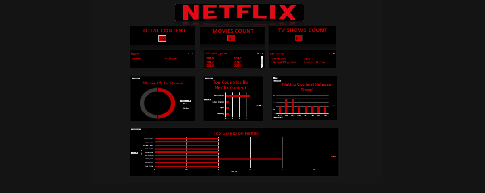

# 📊 Netflix Content Analysis Dashboard

An interactive Excel dashboard designed to analyze Netflix content using data visualization, pivot tables, and slicers.

---

## 🚀 Key Features

- Interactive filters using slicers (Type, Release Year, Country)
- KPI cards showing Total Content, Movies Count, and TV Shows Count
- Movie vs TV Show distribution analysis
- Top countries producing Netflix content
- Content release trends over time

---

## 🛠 Tools & Technologies

- Microsoft Excel
- Pivot Tables
- Slicers
- Data Visualization

---

## 📸 Dashboard Preview

---

## 📂 Dataset Information

The dataset includes:
- Show ID
- Title
- Type (Movie / TV Show)
- Country
- Release Year
- Genre

---

## 💡 Key Insights

- Movies dominate over TV Shows in the dataset
- United States contributes the highest content
- Content production has increased over the years

---

## 🎯 Project Objective

To build an interactive dashboard that helps in understanding Netflix content trends and enables data-driven insights using Excel.

---
